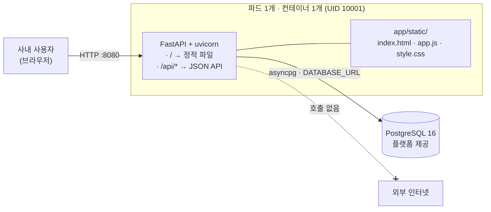
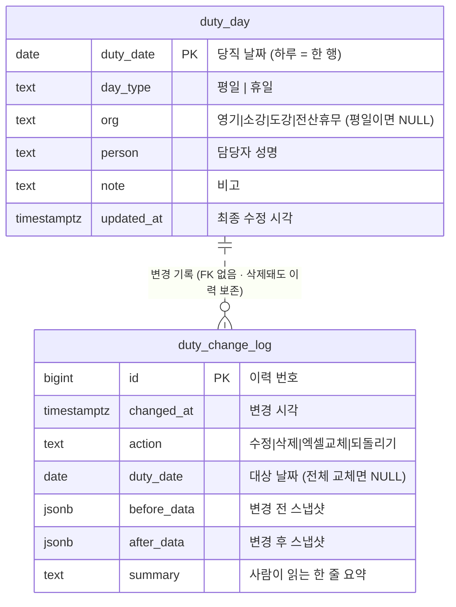
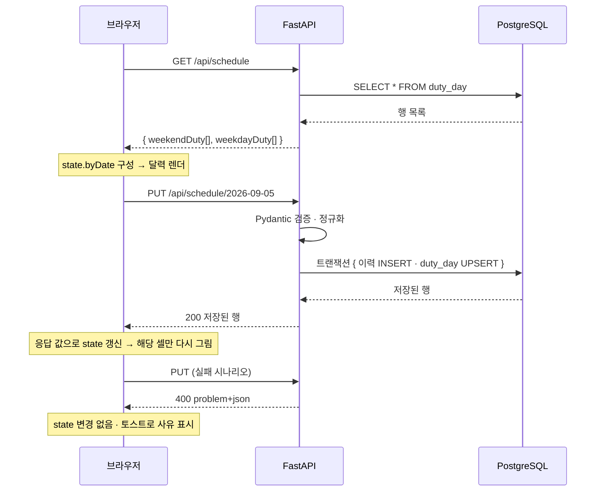

# 당직 일정표 — 상세 설계서

> `prd.md` 기준 설계. 시스템 아키텍트 · 프론트 · 백엔드 · 보안 · QA · DevOps 합의안
> 사내 AI 도구 플랫폼(kt cloud Managed KS) 배포 대상

---

## 1. 전체 아키텍처



**설계 의도**

- 화면과 API를 **한 프로세스**가 서빙한다. 컨테이너 1개 = 도구 1개 (원칙 1).
- 앱은 **상태를 갖지 않는다.** 파드가 몇 개로 늘어나든 진실은 DB 한 곳뿐 (원칙 2).
- 업로드된 엑셀은 메모리에서 파싱하고 즉시 버린다. 디스크에 쓰지 않는다.
- 외부 통신이 **0**이다. 웹폰트·CDN·외부 API를 쓰지 않아 클러스터 이그레스 정책과 충돌하지 않는다.

### 요청 처리 계층

```
HTTP 요청
  → main.py         라우팅 · 보안 헤더 · 예외 → RFC 7807 변환
  → models.py       Pydantic 입력 검증 (여기를 통과하지 못하면 아래로 못 감)
  → services/       업무 규칙 (평일/휴일 정규화 · 엑셀 파싱)
  → repository.py   SQL 전담 (파라미터 바인딩만 허용)
  → PostgreSQL
```

SQL 문자열은 `repository.py` 밖에 존재하지 않는다. 인젝션 점검 범위를 한 파일로 좁히기 위한 배치다.

---

## 2. DB 모델링

### ERD



### 테이블 명세

**`duty_day` — 당직 일정 본체**

| 컬럼 | 타입 | 제약 | 설명 |
|---|---|---|---|
| `duty_date` | `DATE` | PK | 날짜가 곧 식별자. 하루에 두 행이 생길 수 없다 |
| `day_type` | `TEXT` | NOT NULL, CHECK(`평일`,`휴일`) | 구분 |
| `org` | `TEXT` | CHECK(NULL 또는 `영기`·`소강`·`도강`·`전산휴무`) | 휴일 당직 조직. 평일은 NULL |
| `person` | `TEXT` | NOT NULL DEFAULT `''`, ≤50자 | 담당자 성명. **조직과 무관하게 채울 수 있다** (아래 주 참고) |
| `note` | `TEXT` | NOT NULL DEFAULT `''`, ≤200자 | 비고 |
| `updated_at` | `TIMESTAMPTZ` | NOT NULL DEFAULT `now()` | 최종 수정 시각 |

> **`person` 을 영기 조직으로 제한하지 않는 이유** — 원본 엑셀의 해당 열 제목은 「영기 주말 당직」이지만,
> 실제 데이터에는 `2026-09-19 · org=도강 · person=최진필` 처럼 다른 조직 차례에도 담당자가 적힌 행이 있다.
> "영기일 때만 담당자" 규칙을 넣으면 이 값이 저장 시 소리 없이 지워진다.
> **실무 데이터가 규칙보다 우선한다.** 제약은 열거값·길이 검증까지만 두고, 담당자 유무는 사용자 판단에 맡긴다.

> **왜 두 테이블(주말/평일)로 나누지 않는가** — 원본 엑셀은 표가 둘이지만 실제로는 **한 날짜에 당직 상태 하나**다.
> 두 표로 나누면 "같은 날짜가 양쪽에 다른 값으로 존재"하는 모순 상태를 DB가 막아주지 못한다.
> 한 행으로 합치면 PK 제약만으로 그 모순이 원천 차단된다. 기존 화면이 기대하는 두 배열은 조회 시 변환해 내려준다.

**`duty_change_log` — 변경 이력 (되돌리기 근거)**

| 컬럼 | 타입 | 설명 |
|---|---|---|
| `id` | `BIGINT GENERATED ALWAYS AS IDENTITY` | PK |
| `changed_at` | `TIMESTAMPTZ` | 변경 시각 |
| `action` | `TEXT` | `수정` · `삭제` · `엑셀교체` · `되돌리기` |
| `duty_date` | `DATE` NULL | 하루 변경이면 그 날짜, 전체 교체면 NULL |
| `before_data` | `JSONB` NULL | 변경 전 상태. 하루면 행 1개, 전체 교체면 **전체 스냅샷** |
| `after_data` | `JSONB` NULL | 변경 후 상태. 삭제면 NULL |
| `summary` | `TEXT` | 예: `2026-09-05 영기 배병모 → 영기 황성용` |

**인덱스**

| 인덱스 | 대상 | 목적 |
|---|---|---|
| `duty_day_pkey` | `duty_date` | 날짜 단건 조회·upsert |
| `idx_duty_day_range` | `(duty_date)` 범위 스캔 | 월/기간 조회 (PK로 커버됨, 별도 생성 불필요) |
| `idx_change_log_at` | `changed_at DESC` | 최신 이력 조회 |

**개인정보** — 성명 외 사번·연락처·소속코드를 저장하지 않는다. 예상 행 수는 연 366행으로 용량 이슈가 없다.

---

## 3. API 명세

공통: 요청·응답 `application/json; charset=utf-8`, 오류는 `application/problem+json` (RFC 7807).

### GET `/api/health` — 헬스체크

readinessProbe 용. DB 연결까지 확인한다.

```json
200 OK  { "status": "ok", "db": "ok" }
503     { "type":"about:blank", "title":"서비스 준비 안 됨", "status":503, "detail":"일시적으로 조회할 수 없습니다" }
```

### GET `/api/schedule` — 일정 조회

| 파라미터 | 타입 | 필수 | 설명 |
|---|---|---|---|
| `from` | `YYYY-MM-DD` | 아니오 | 시작일. 미지정 시 전체 |
| `to` | `YYYY-MM-DD` | 아니오 | 종료일. `from`~`to` 최대 400일 |

```json
200 OK
{
  "meta": { "updatedAt": "2026-09-07T02:11:00Z", "count": 122 },
  "weekendDuty": [
    { "date":"2026-09-05","weekday":"토","type":"휴일","org":"영기","person":"배병모","note":"" }
  ],
  "weekdayDuty": [
    { "date":"2026-09-01","weekday":"화","type":"평일","person":"임나현" }
  ]
}
```

> `weekday`(요일)는 저장하지 않고 **날짜에서 계산해 내려준다.** 저장하면 날짜와 어긋날 수 있는 중복 정보가 된다.

### PUT `/api/schedule/{duty_date}` — 하루 등록·수정 (upsert)

```json
요청  { "dayType":"휴일", "org":"영기", "person":"황성용", "note":"명절연휴" }
200   { "date":"2026-09-24","weekday":"목","type":"휴일","org":"영기","person":"황성용","note":"명절연휴" }
400   { "title":"입력값 오류", "status":400, "detail":"허용되지 않은 당직 조직입니다" }
```

**서버 정규화 규칙 (클라이언트를 믿지 않는다)**

| 입력 | 서버 처리 |
|---|---|
| `dayType="평일"` 인데 `org` 가 옴 | `org` 를 NULL 로 무시 (평일은 3팀 순환 대상이 아님) |
| `person`·`note` 앞뒤 공백 | trim |
| 제어문자·개행 포함 | 제거 |
| 정의되지 않은 필드가 섞여 옴 | 요청 자체를 400 으로 거부 (`extra="forbid"`) |

### DELETE `/api/schedule/{duty_date}` — 하루 비우기

없는 날짜여도 `204`. **멱등**이다.

### POST `/api/schedule/import` — 엑셀 일괄 반영

**요청 본문에 `.xlsx` 바이트를 그대로 전송**한다(`multipart` 아님). **10MB 상한**.

> `multipart/form-data` 를 쓰지 않는 이유 — Starlette 의 `UploadFile` 은 1MB 를 넘는 업로드를
> `SpooledTemporaryFile` 로 **디스크에 흘린다.** 무상태성 원칙과 `readOnlyRootFilesystem` 선언에 정면으로 걸린다.
> 본문을 스트림으로 받아 메모리에서 상한을 걸면 디스크를 건드리지 않고, `python-multipart` 의존성도 사라진다.

```json
200 { "replaced": 144, "snapshotId": 87, "message":"144건으로 교체했습니다" }
400 { "title":"엑셀 형식 오류", "status":400, "detail":"당직표 형식을 인식할 수 없습니다" }
413 { "title":"파일이 너무 큼", "status":413 }
```

**처리 순서 — 순서 자체가 방어 장치다.**

```
1) 크기·확장자 검사        ← 통과 못 하면 본문을 읽지도 않는다
2) 메모리에서 파싱 · 전건 검증  ← 한 행이라도 이상하면 여기서 중단
3) 트랜잭션 시작
4) 기존 전체를 before_data 로 이력에 기록  ← 되돌릴 근거 확보
5) DELETE ALL → INSERT 신규
6) 커밋
```

**4번이 5번보다 먼저**라는 점이 핵심이다. 2번에서 중단되면 기존 데이터는 손도 대지 않은 상태다.

### GET `/api/history?limit=50` — 변경 이력

```json
200 { "items":[ { "id":87,"changedAt":"2026-09-07T02:11:00Z","action":"엑셀교체",
                  "dutyDate":null,"summary":"엑셀 일괄 교체 (122건 → 144건)","revertable":true } ] }
```

### POST `/api/history/{id}/revert` — 되돌리기

해당 이력의 `before_data` 로 복원하고, 그 복원 자체를 다시 `되돌리기` 이력으로 남긴다(되돌리기의 되돌리기 가능).

### 인증 (선택)

`ADMIN_KEY` 환경변수가 **주입된 경우에만** 수정 계열(`PUT`·`DELETE`·`import`·`revert`)이 `X-Admin-Key` 헤더를 요구한다.
미주입 시 사내망 사용자 누구나 수정 가능(현 정책). 키 비교는 `hmac.compare_digest` 로 타이밍 공격을 피한다.

---

## 4. 폴더 구조 및 분리 전략

```
youngki_dangzik/
├─ Dockerfile                  # 저장소에 정확히 1개
├─ .dockerignore
├─ requirements.txt            # 버전 고정 (SCA 진단용)
├─ schema.sql                  # 운영자가 최초 1회 실행 (DDL + 초기 데이터)
├─ prd.md · design.md          # 기획·설계 산출물
├─ app/
│  ├─ main.py                  # FastAPI 앱 · 라우팅 · 보안 헤더 · 예외 핸들러
│  ├─ config.py                # 환경변수 로딩 (여기 외에는 os.environ 접근 금지)
│  ├─ db.py                    # asyncpg 커넥션 풀 수명주기
│  ├─ models.py                # Pydantic 요청/응답 스키마
│  ├─ errors.py                # RFC 7807 문제 응답 생성
│  ├─ repository.py            # SQL 전담 (파라미터 바인딩만)
│  ├─ services/
│  │  ├─ schedule.py           # 정규화 · 두 배열 변환 · 이력 요약문 생성
│  │  └─ excel.py              # 엑셀 파싱 (openpyxl, read_only 모드)
│  └─ static/                  # ← 화면 정본
│     ├─ index.html
│     ├─ app.js
│     └─ style.css
└─ (기존 GitHub Pages 자산: index.html · app.js · style.css · data/ · scripts/ · .github/)
```

**분리 원칙**

| 파일 | 책임 | 금지 |
|---|---|---|
| `config.py` | 환경변수 읽기 · 기본값 · 유효성 | 다른 파일에서 `os.environ` 직접 접근 |
| `repository.py` | SQL 실행 | SQL 문자열 결합, 업무 규칙 판단 |
| `services/*` | 업무 규칙 | HTTP·SQL 세부사항 접근 |
| `main.py` | HTTP 경계 | 업무 규칙 구현 |

### 기존 GitHub Pages 버전 전환 계획

지금 팀이 실제로 쓰는 것은 GitHub Pages 버전이다. 사내 배포 승인까지 1~2영업일이 걸리므로
**공백 없이 넘기기 위해 한동안 둘을 함께 둔다.**

| 시점 | 상태 |
|---|---|
| 지금 | 루트 정적 자산 = 운영 중(**동결**, 더 이상 수정하지 않음) · `app/static/` = 사내용 정본 |
| 사내 배포 완료 후 | 루트 정적 자산 · `data/` · `.github/workflows/deploy-pages.yml` 제거, 사내 주소로 단일화 |

이 기간 중 화면 수정 요청은 **`app/static/` 에만 반영한다.** 두 벌을 각각 고치기 시작하면 그때부터 갈라진다.

---

## 5. 상태 관리 및 전역 상태 흐름

프론트엔드는 빌드 도구·프레임워크 없이 **단일 상태 객체 + 순수 렌더 함수**로 유지한다.

```javascript
const state = {
  byDate: new Map(),   // "2026-09-05" → { date, weekday, type, org, person, note }  ← 유일한 진실
  viewYear, viewMonth, // 보고 있는 달
  editMode: false,     // 수정 모드 on/off
};
```



**규칙**

- **낙관적 업데이트를 하지 않는다.** 서버가 저장을 확인해 돌려준 값만 상태에 반영한다.
  화면에는 성공한 것처럼 보이는데 DB에는 안 들어간 상태를 만들지 않기 위해서다.
- 월 이동은 **재요청 없이** 로컬 상태로만 렌더한다.
- 렌더 함수는 `state` 만 읽고 DOM을 만든다. 이벤트 핸들러는 상태를 바꾸고 렌더를 호출한다.

---

## 6. 보안 대책 및 예외 처리

| 위협 | 대책 | 구현 위치 |
|---|---|---|
| **SQL 인젝션** | 모든 쿼리를 asyncpg 파라미터 바인딩(`$1`)으로만 실행. SQL 문자열 결합 전면 금지 | `repository.py` |
| **XSS** | 값 출력은 `textContent`·`createElement` 만 사용. `innerHTML` 에 사용자 입력을 넣지 않음. CSP `default-src 'self'` | `app/static/app.js`, `main.py` |
| **잘못된 입력** | Pydantic 타입·길이·열거값 검증 → 통과 못 하면 400. 서버 정규화로 모순 상태 차단 | `models.py`, `services/schedule.py` |
| **CSRF** | 쿠키·세션을 쓰지 않아 브라우저가 자동 첨부할 자격증명이 없음. 관리자 키는 **헤더**로만 받음 | 설계상 해소 |
| **대용량 업로드 DoS** | 10MB 상한을 본문 소비 **전에** 검사. `read_only` 파서로 메모리 상한 | `main.py`, `services/excel.py` |
| **엑셀 폭탄(수식·외부참조)** | `openpyxl` `data_only=True` + `read_only=True` — 수식 평가·매크로 실행 없음 | `services/excel.py` |
| **파괴적 실수** | 일괄 교체 전 전체 스냅샷 이력화 → 되돌리기 제공 | `services/schedule.py` |
| **정보 노출** | 오류 응답에 스택·SQL·접속정보 미포함. 상세는 서버 로그에만, 로그에도 비밀값·개인정보 미기록 | `errors.py` |
| **비밀정보 하드코딩** | 접속정보·키를 전부 환경변수로. 소스·신청서에 실제 값 미기재 | `config.py` |
| **클릭재킹·MIME 스니핑** | `X-Frame-Options: DENY`, `X-Content-Type-Options: nosniff`, `Referrer-Policy: no-referrer` | `main.py` |
| **권한 상승** | 컨테이너 비루트 UID 10001, `readOnlyRootFilesystem` 가능, 8080 리슨 | `Dockerfile` |

**적용하지 않은 것과 그 이유**

- **레이트 리미팅** — 사내망 한정·이용자 10명 내외 도구로 과설계다. 파드가 여러 개면 인메모리 카운터가 부정확해 오히려 잘못된 안전감을 준다. 대신 업로드 크기 제한과 되돌리기로 피해를 제한했다.
- **감사 주체(누가) 기록** — 인증이 없어 신뢰할 수 있는 주체를 특정할 수 없다. IP를 남기는 것은 목적 대비 개인정보 수집이라 하지 않는다. "언제 무엇이 어떻게 바뀌었나"만 남긴다.

**예외 처리 방침** — 예외는 구체 타입으로 잡는다(`except Exception` 광범위 포획 금지).
DB 오류·검증 오류·파싱 오류를 각각 구분해 사용자에게는 대응 가능한 문장을, 로그에는 원인을 남긴다.

---

## 7. 비개발자를 위한 3줄 요약

1. 지금은 **당직표가 엑셀 파일 한 장**이라, 그 파일을 가진 사람만 보고 고칠 수 있습니다.
2. 이걸 **사내 서버에서 도는 달력 웹페이지**로 바꿉니다. 링크만 알면 누구나 보고, 화면에서 바로 고칩니다.
3. 고친 내용은 **회사 데이터베이스**에 남고, 잘못 고쳤으면 **되돌릴 수 있습니다.**

> **비유** — 지금은 팀의 당직표가 **각자 책상 서랍 속 복사본**입니다. 누가 원본을 고쳐도 남의 복사본은 옛날 그대로죠.
> 이번 작업은 그 복사본을 다 걷고 **사무실 벽에 화이트보드 한 장**을 거는 일입니다.
> 누구나 지나가며 보고, 바뀌면 그 자리에서 고치고, 모두가 같은 판을 봅니다.
> 화이트보드 옆에는 **"누가 언제 뭘 지웠는지 적힌 공책"** 을 함께 겁니다 — 실수로 다 지워도 공책을 보고 되살립니다.

---

## 다음 단계

STEP 3 개발 — ① 프로젝트 초기화 → ② DB 연동·공통 유틸 → ③ 백엔드 API → ④ 프론트엔드 API 연동 순으로 나눠 구현한다.
